# Rhine Music Demo · V0.3.0 设计细节

> 本文对应 **V0.3.0 · 2026-10-01**。下方当前详情截图来自 V0.3.0 的隔离示例库；图 1–9 的图片、GIF 和示意图保留自 V0.2.0，均标为历史配图。现行布局和交互以本版文字、源码与新版截图为准；检查范围见 [界面回归记录](docs/UI-REVIEW-V0.3.0.md) 和 [发布检查](docs/RELEASE-V0.3.0.md)。

本文记录截至 2026-10-01 当前音乐入口实际保留的设计、交互与实现依据，供后续维护和视觉复核。安装、发布与资源许可见 [README](README.md)、[CHANGELOG](CHANGELOG.md) 和 [原版说明](README.original.md)。历史实验仅作为取舍依据，不覆盖下文的当前行为。

这份文档结合当前截图与 V0.2.0 历史 GIF，展示底部滑尺与编号联动、逐字滚动、玻璃专辑抽取、详情连续换片和昼夜主题。每张动图旁说明其动作与设计意图。历史实拍使用内置演示封面，长短标题片段来自隔离的示例曲库；配套路线与布局图标为示意。[V0.2.0 配图记录](docs/media/v0.2.0/design/README.md)列出当时的采集与编码方式。

*V0.3.0 当前详情 · 1920 × 1080。Esc 返回按钮固定在品牌下方，顶部中文曲库统计已移除。截图使用三张内置演示封面及 54 条占位曲目，曲名、时长和数量属于隔离示例库；不包含私人音乐，也不作为音频播放验证。[最新界面检查](docs/UI-REVIEW-V0.3.0.md)。*

设计来源与版本演进

音乐适配由 RonaldDeng 维护，基于 LBEILC 的 [RhineLabUI](https://github.com/LBEILC/RhineLabUI)，初始上游基线为 [5abab02](https://github.com/LBEILC/RhineLabUI/commit/5abab02367465d9189f4ae65bcb6f17fdb5938f7)。上游主要参考《明日方舟》特别映像「莱茵生命：访问」的 5–40 秒，以 TypeScript、Three.js、Vite 实时实现三维场景与 DOM 界面，并通过 Blender MCP 制作模型；产品不使用参考视频作为动态背景。

保留的设计来源包括：细线与紧凑的中英文层级、玻璃卡片阵列、远距镜头压缩透视、浅抽取预览、保留位置与速度的连续切换，以及与编号一致的直接字轮。MiSans 保留官方原版 WOFF2 与 300、400、600、700 字重，字体来源及许可见 [NOTICE](public/fonts/NOTICE.txt) 和 [字体许可](public/fonts/MiSans-license.pdf)。原标志、原片、模型、字体和音频各自的权利边界不因代码采用 MIT 而改变，详见 README 的资源说明。

| 阶段 | 当时的设计与当前保留部分 |
| --- | --- |
| 原版 RhineLabUI | 档案终端、抽取阵列、模型材质、临界阻尼、直接字轮、解密正文与查看器构成基础。原版入口由 `?original=1` 保留；原版固定五类档案、内部环组、2D 片头和独立拆解查看器不是当前音乐功能。 |
| V0.0.1 | 早期音乐适配，原本地目录为 RhineLabUI；加入本地曲库、播放队列、音乐专辑卡片与双主题，不等同于上游档案终端。 |
| V0.0.2 | 在音乐适配上继续调整相机与灯光，形成薄玻璃 CD 盒、实际封面、曲库和播放界面。当时采用抽取后段再与侧移交叠、回中后再接下降的分阶段路线；后来被同步抽取与取景取代。 |
| V0.0.3 | 恢复约 5.2 秒三维进场，停在待选状态；每列循环池扩为 48 个位置。形成歌曲字幕、双主题、滑尺与排列选项等音乐界面，仍保留当时的分阶段镜头。 |
| V0.1.0 | 将 V0.0.3 整理为 macOS 发布版本：确定 4.45 × 3.35 × 0.14 盒体、2.98 × 2.98 封面、根目录独立单曲、排列选择、滑尺、主题滑动底板与启动入口。 |
| V0.1.1 | 竖屏时淡出深夜右侧遮罩，横屏时恢复；保留上下边缘与阅读底色。 |
| V0.1.1b | 详情改为同步抽取与俯视构图；上一张／下一张直接沿队列换片；将详情速度与主界面速度隔离；统一 1.05 宽高比分界；加入当时默认关闭的顺序淡出／淡入开关。 |
| V0.2.0 | 区分搜索与详情换片路线，加入歌曲定位提示；重做多行标题的逐字滚动与布局准备，修复下伸笔画残影；拆分主页淡入图层；统一封面比例与受光。壳体已恢复 V0.1.1b 质感；淡入淡出对新偏好默认开启，已有选择保留。 |
| V0.3.0 | 横屏主页文字与取景调整、暖昼壳体可见度、封面连续性、播放标题定位及两次曲目高亮；Esc 返回按钮统一放在品牌下方，移除顶部中文曲库统计。2026-10-01 macOS 源码发行版。 |

V0.0.2/V0.0.3 的相机过程、滑尺试用和早期性能记录仍可追溯于 [过渡记录](verification/MUSIC-PRESENTATION-V2.md)、[相机记录](verification/MUSIC-CAMERA-V2.md)、[滑尺记录](verification/MUSIC-NAVIGATION-RULER-TRIAL.md) 和 [性能记录](verification/MUSIC-PERFORMANCE.md)。这些是当时的记录；其中的旧参数、试验结论和检查结果不能替代本版行为与验收。

## 界面构图与导航细节

### 头部

- 左上保留 `RHINE LAB / MUSIC ARCHIVE / 私人音乐终端` 的品牌层级。右侧顺序为音乐库、搜索、暖昼／深夜、设置、当前歌名和播放控制；没有另加大面积播放器面板。
- 音乐库与搜索以线性图标配文字；空间不足时保留图标与可访问名称。设置使用滑杆图标。搜索按钮不再显示额外的 `/` 小标，但键盘快捷键仍有效。
- 主题开关只有暖昼、深夜两个公开选项。它们共用一个底板，约 380ms 横向移动；文字约 260ms 转色。底板始终位于按钮文字下方，选中态通过 `aria-pressed` 同步。代码中的历史 dusk 配色不表示产品提供第三个主题。
- 播放／暂停共用一个固定位置按钮，两个图形按真实播放状态进行 180ms 透明度与缩放切换；停止按钮独立保留。图形样式限定在播放按钮内，避免影响启动标志或扫描图形。
- 竖屏把品牌与控制分成两行；第二行使用固定的图标与主题格位，剩余空间分给歌名和播放按钮。主题文字继续显示，避免两个主题只剩难辨认的圆点。

*图 1 · V0.2.0 历史配图：实际操作。由左至右是音乐库、搜索、主题、设置和播放控制。观察主题底板连续横移、两组文字交替变色；控件始终留在原来的导航顺序中。*

### 播放歌名字幕

播放、暂停或加载歌曲时，右上显示当前歌名；停止后收起。歌名占位宽度约 640ms 展开，透明度约 400ms 进入，内层从右侧 18px 归位。展开空间由前面的控件让出，播放按钮保持在右侧。

歌曲之间切换复用 460ms 直接字轮，不重建整个头部。可用宽度随窗口和控制布局变化，超长歌名按实际字宽省略，完整名称保留在标题提示和语义文字中。歌名同时作为定位按钮，点击后定位到该歌曲；所属专辑已打开时直接滚动，其他情况经专辑架打开；歌单当前曲目高亮是另一项状态，不额外叠加小播放／暂停图标。

实现见 [music-transport-title.ts](src/music-transport-title.ts)、[对应样式](src/music-transport-title.css) 和 [主题开关样式](src/music-theme-switch.css)。

### 待选专辑信息与辅助标志

- 横屏待选信息左边界为 68.633333%，右边距为 max(24px, 2.2%)，区域占约 29.17% 屏宽；竖屏放在模型下方、导航上方。标题块底界根据实际导航位置计算，不用固定字号硬挤长标题。
- 上眉为 `MUSIC ARCHIVE / 当前排列列名`。细线一侧是三位 `ALBUM 001` 编码，另一侧为文件格式；其下依次是标题、歌手、年份／曲目数／时长和“打开专辑 ↗”。
- 三位 ALBUM 编码来自当前记录排列的全局序号；底部 `ALBUM / SELECT` 大数字表示当前列内位置及本列总数。这两个数字用途不同，均不作为持久曲库 ID。
- 底部分类区显示当前排列类型的代码、列位置／总列数和可点击列名。左右箭头切列，上下箭头切专辑；按歌手或专辑名排列时，标签随实际排列更新。
- 键盘辅助行保留左右切列、上下切专辑、Enter 打开的提示。最底行显示本地收藏数量与运行帧率／主题；窄屏按既有空间规则收紧或隐藏次要提示。
- 详情保留“← 返回专辑架”和 ESC 标志、三位 ALBUM 编码及拖动查看封面的说明。所有屏幕比例下，返回按钮均位于左上 Rhine Music 标识下方，沿用标识左边界；移除顶部中文曲库统计，底部英文 `LOCAL COLLECTION` 继续展示专辑／曲目数。竖屏隐藏拖动小字，把编码放在模型与正文之间。右上上一张／下一张与正文属于同一详情界面。
- 深夜主要文字为 `#e9eef2`，辅助文字为 `#9caabd`，线条使用浅蓝灰透明色；曲库状态提升为主要文字亮度，状态点仍表达工作状态。没有以文字阴影代替对比度调整；尚未据此宣称通过特定对比度认证。

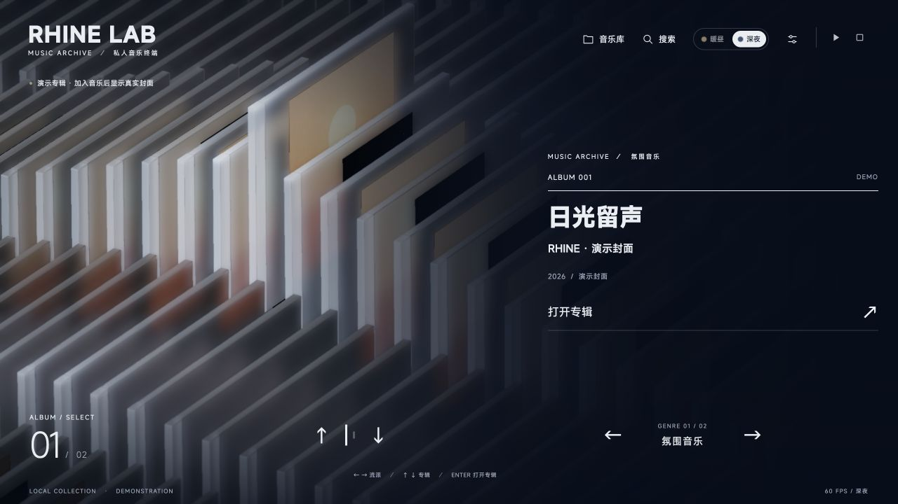

*图 2 · V0.2.0 历史配图：实际界面的阅读顺序。右侧 `ALBUM 001` 标识当前排列的全局记录；左下大数字表示列内位置；底部短刻度和上下箭头切专辑，右下列名和左右箭头切分类。最底行的键盘提示、收藏状态和帧率属于辅助信息。图中使用两张同列演示专辑，因此只出现两个有效刻度。*

实现见 [music-app.ts](src/music-app.ts)、[music.css](src/music.css) 和 [music-text-motion.ts](src/music-text-motion.ts)。

### 底部滑尺

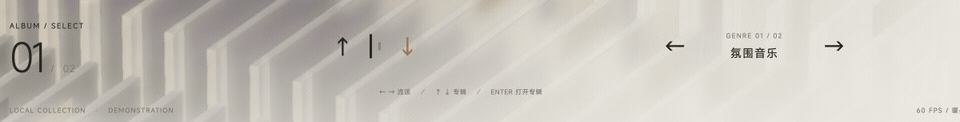

*图 3 · V0.2.0 历史配图：先向下切一张专辑，再向右切换流派，最后向左返回。观察选中刻度如何伸长、旧刻度如何缩回，以及专辑编号、分类文字和总数如何同步滚动。方向键、滑尺与数字共同表达“我现在在哪一列、哪一张”，不需要另开导航面板。*

默认滑尺显示至多 12 个可见刻度，并复用两侧预留位置。选中刻度自身增高，旧刻度缩回；没有独立的大竖条跳到新位置。超过 12 张时尺面逐格移动，两端通过渐隐遮罩进出；首尾循环延续物理方向，不把尺面重置到起点。

桌面刻度为 3px 宽，常态 10px、选中 30px、悬停 22px，间隔 8px；窄屏改为 2px 宽、8／21／16px 高、6px 间隔。切换分类时保留宽度变化、出现／退出和原有轻微波动；临界阻尼在快速反向时接续当前位置与速度。离开可见区的刻度才能复用，隐藏预留位置不能点击或获取焦点。

点击循环边缘刻度传递的是该次可见出现对应的相对行位移，避免跳到另一周期的同名专辑。旧刻度仍可通过 `?nav=previous` 对照；当前默认入口为滑尺。实现见 [music-ruler.ts](src/music-ruler.ts) 和 [music-navigation-ruler.css](src/music-navigation-ruler.css)。

## 比例、取景与详情路线

### 一个比例决定模型和正文位置

相机和 DOM 共用 [viewport-layout.ts](src/viewport-layout.ts) 的判断：舞台宽／高小于 **1.05** 为竖屏，等于或大于 1.05 为横屏。小于 1100px 等宽度规则仍可调整字号和控件密度，但不能独立决定详情正文从右边移动到底部。

音乐舞台使用窗口实际尺寸，不把整个音乐界面缩放成固定 1920 × 1080 画布。音乐主页所有横屏取景下移 8% 屏高，为抬起的专辑保留顶部空间；在 16:9 到 21:9 之间平滑增加到下移 10%，同时向左偏移由 0 增至 3.5% 屏宽，更宽时保持该偏移。偏移由相机完成，进场末段和浏览共用同一目标，详情终点与竖屏不受影响。横屏详情保留左侧模型与右侧正文，返回按钮固定在左上品牌标识下方；竖屏把模型放在上方，正文从约一半屏高开始并独立滚动。短屏允许待选信息区自身滚动；取景通过相机锚点和视场范围调整，不改变 CD 盒的物理比例。

横屏主页阅读渐变节点为 42%／66%／96%，随名称区右移；深夜侧向渐变为 32%／58%／78%，进入详情恢复原节点并以 650ms 平滑过渡。深夜侧向阅读遮罩也使用同一 `data-layout`：进入竖屏后约 650ms 淡出，横屏恢复。上下边缘与下方阅读底色仍在，避免竖屏出现不必要的右侧暗区。

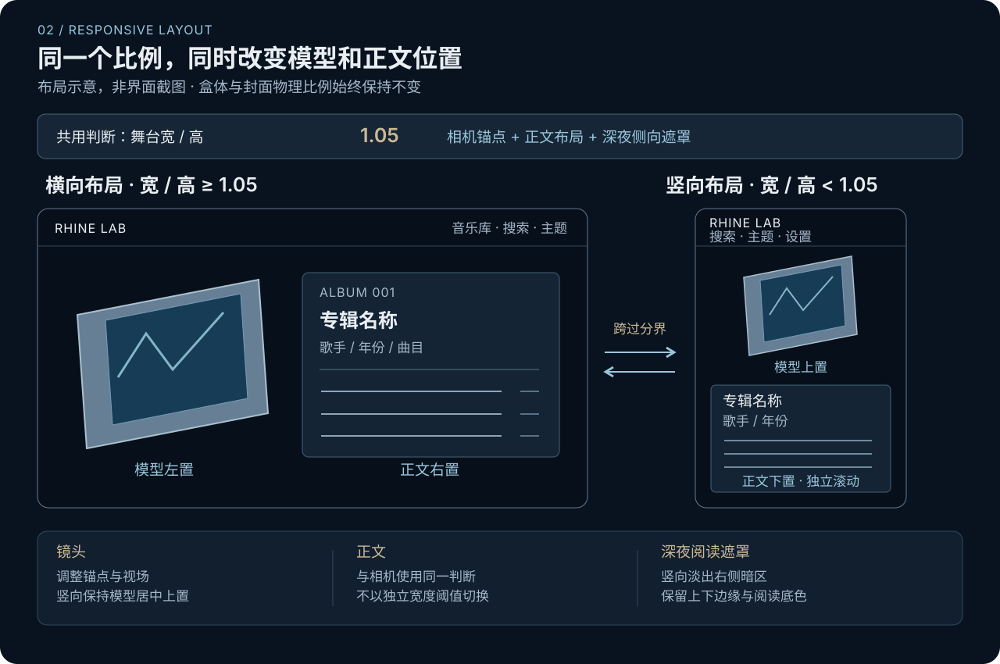

| 960 × 900，宽高比约 1.067 | 930 × 900，宽高比约 1.033 |
| --- | --- |
| 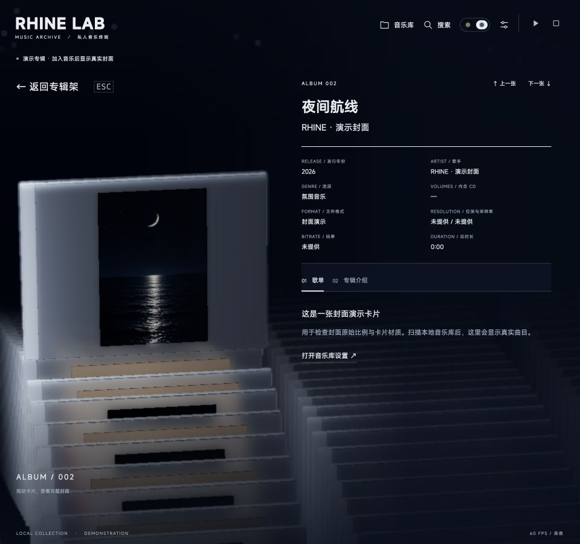 | 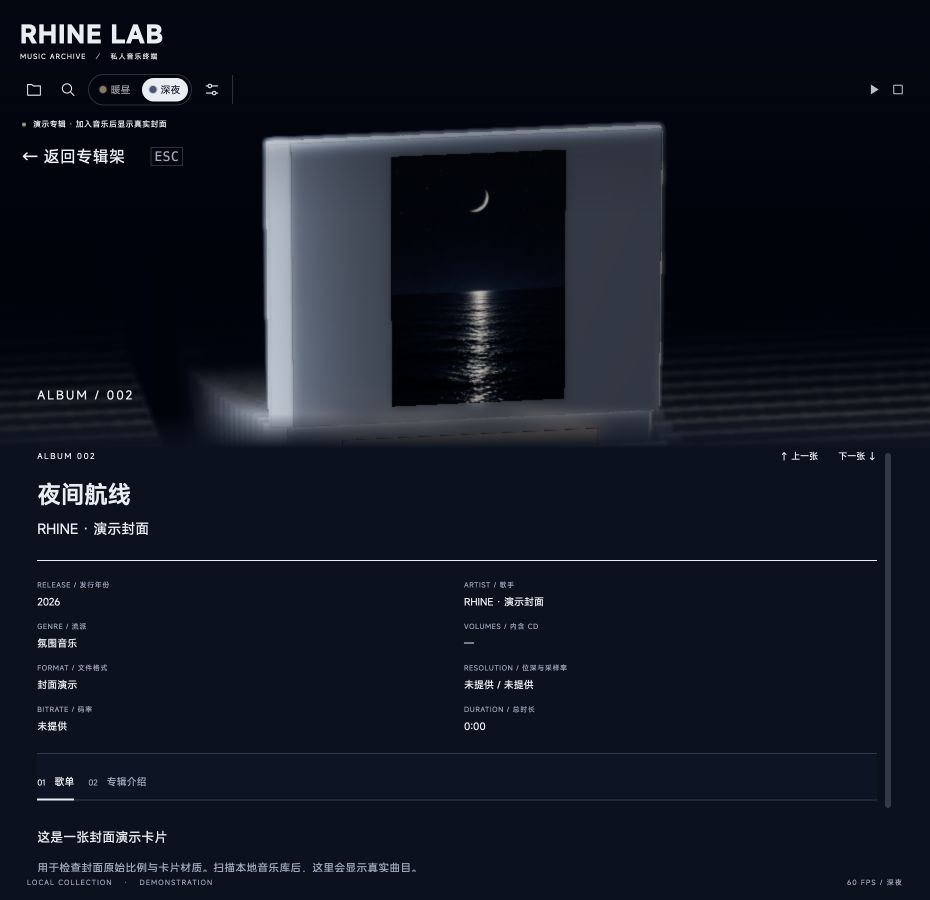 |
| 正文保留右侧，相机为右侧阅读区留白。 | 正文移到下方，相机同步把模型放到上方中央。 |

*图 4 · V0.2.0 历史配图：示意图与同一专辑的实际对照。高度保持 900px，只改变宽度跨过分界；这里的“横／竖”指应用布局模式。点击截图可查看原尺寸，避免把缩略图中文字大小误认为实际字号。*

### 抽取和相机同时完成

音乐盒运行时为 **4.45 × 3.35 × 0.14** 世界单位，封面为 **2.98 × 2.98**。待选浅抬起量为 0.9，详情抽取量为盒高加 0.12；目标是盒底刚离开阵列，同时保留附近专辑的空间关系。

详情镜头保持约 **20° 俯视、8° 水平斜视**，比待选构图稍平，不能回到正面平视。抽取、镜头上抬和给正文留白的侧移共用同一呈现进度；不等侧移完成后才改变俯仰。竖屏使用同一动作逻辑，但终点保持模型居中上置。

首次打开需要阵列到达可打开状态，正文再随呈现状态进入。模型拖动仍受净空与旋转归位规则约束；返回保留归正检查，不能让旋转中的盒体直接穿入相邻专辑。以上由实际状态门槛决定，不靠固定定时器猜测动画完成。

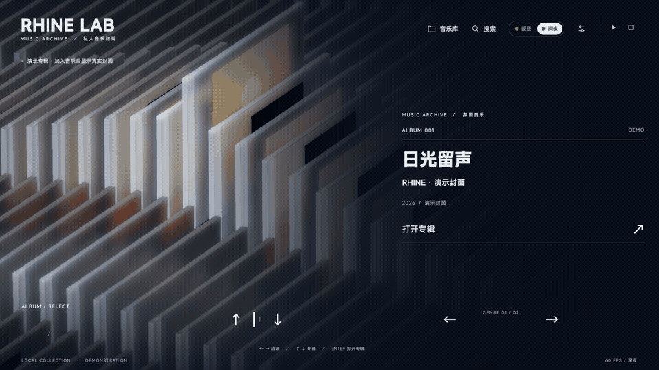

*图 5 · V0.2.0 历史配图：从待选状态打开详情。观察盒底离开阵列的过程，以及相机俯仰和侧移如何交叠推进；终点仍保留俯视与附近专辑，不转换成平视孤立展示。*

### 三种路线必须区分

| 触发 | 当前路线 | 文字与速度约束 |
| --- | --- | --- |
| 主界面打开专辑 | 当前专辑浅抬起 → 同步抽取与详情取景 → 正文进入 | 阵列先稳定；保留原主界面移动节奏。 |
| 详情内上一张／下一张 | 正文退出 → 保持详情取景沿队列移动，旧盒归位与新盒抽取 → 新正文进入 | 不经过主界面构图；详情专用快速阻尼只在详情换片阶段生效。 |
| 搜索结果或跨专辑的顶部播放歌名定位 | 正文退出 → 回到专辑架 → 按原浏览速度移动到目标行列 → 重新打开 | 必须使用 archive 路线，不能借用详情直接换片的加速路径。 |

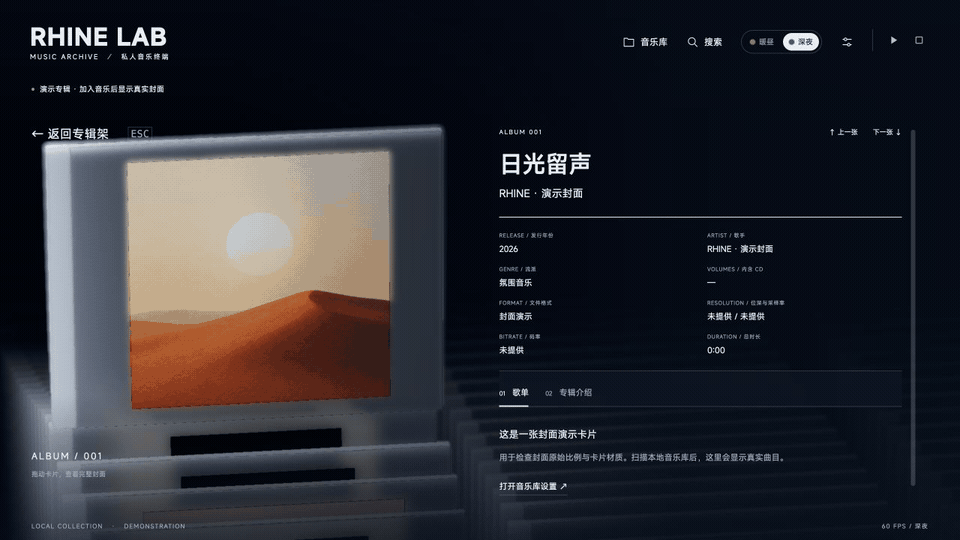

*图 6 · V0.2.0 历史配图：实际点击详情“下一张”。旧正文先退出，旧盒回落、新盒抽出，阵列沿队列移动，镜头保持详情构图，最后新正文进入。让连续翻看专辑像在同一条架上取放唱片，而不是反复退出再打开页面。*

查看主页、详情和搜索的三种导航路线

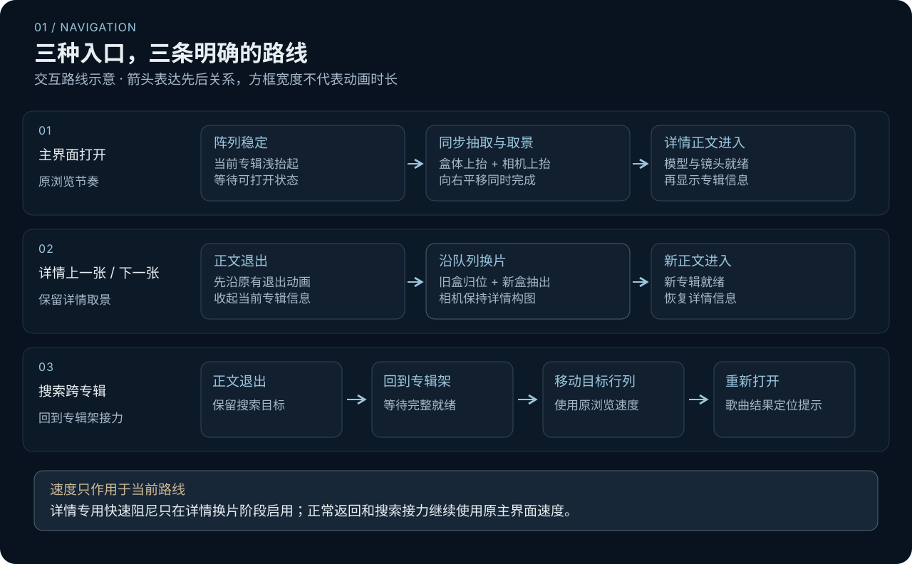

图中箭头表达操作先后关系，框宽不代表时长；搜索曲目定位不由无歌曲的演示模式代替验证。

正常返回可在专辑架重新可操作时开始显现浏览文字，镜头最后的小幅收敛继续完成；搜索自动接力则等待专辑架完整就绪，再开始目标移动。连续点击或键盘输入保留最新目标，过时的动画完成回调不得打开旧专辑；Esc 或返回能取消继续打开的意图。

详情专用速率不能泄漏到主界面。当前代码仅在 `navigationLift && musicPresentation.placed` 时使用快速速率 9；普通浏览继续使用原来的肩部、列焦点、相机和升降阻尼。标题优化与分层淡入都不修改这些速度。

实现见 [music-presentation.ts](src/music-presentation.ts) 与 [scene.ts](src/scene.ts)。V0.0.2/V0.0.3 曾采用的“先回中到约 65%，再接转向下降”和分段抽取侧移，仅为历史路线，不是本版同步镜头的规范。

## 字符动画与阅读节奏

### 标题仍是逐字滚动

主标题继承原版 **460ms、direct、向上、无逐字延迟** 的节奏。V0.2.0 使用专门的标题字轮承载原生多行布局；编号、分类和合适长度的辅助文字继续复用 Rolling Number 控件。性能处理不能用静态出现或整块淡入取代每字运动。

- 新增第二行的字从空白滚入，撤去的行滚向空白；文字位置与总高度同步过渡。标题从长到短再变长，仍延续正在显示的字面。
- 快速输入只衔接当前可见过渡与最新目标，不排队播放全部中间标题。字号变化使用像素位移与独立字面尺寸，保留旧／新字面可见宽度，避免旧宽字被新窄槽突然截掉。
- 同一标题、同一布局不重复播放。元数据稍后测量得到等价布局时，不会在下一帧提前结束 460ms 动画。
- 主标题行高为 1.4，字轮上下边缘的淡出范围缩小至 0.02em，保留 g／y／p／j 的下伸笔画；前后字面仍按各自行高裁剪隔离，避免退出文字残留。
- 减少动态效果直接落到最终标题。字体加载和窗口尺寸变化重新计算布局，不能沿用过期字宽；语义标题和完整名称始终保留，装饰字面不向辅助技术重复朗读。

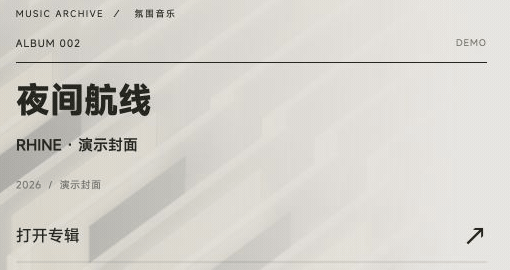

*图 7 · V0.2.0 历史配图：“夜间航线”切换为“日光留声”。标题与上方编号使用同一种向上滚动的视觉语言：文字更新有方向和节奏，阅读位置仍然稳定。每个字一起启动，不逐字排队，快速浏览时也不拖慢信息更新。*

### 单行、多行与尺寸的连续变化

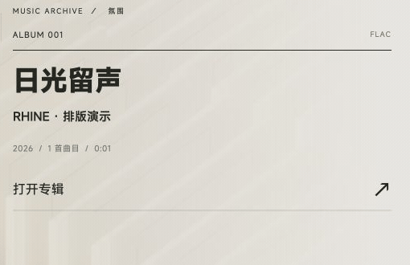

*图 7b · 短标题 → 两行长标题 → 短标题。观察字号、标题高度和下方歌手、年份的位置如何一起变化。使用隔离的示例曲库实录，标题仅供排版演示，沿用发行版原有动画。*

**标题的排版变化也参与动画。** 从短专辑名切到长专辑名时，第一行继续按字滚动，新增的第二行也从空白滚入，标题区域同时展开；再切回短名字时，多出的行滚向空白，整体高度随之收拢。下方歌手、年份等信息跟随标题区域的高度变化重新就位，保持原有阅读顺序。

字号调整融入同一段字轮交接：旧字号的字面向上退出，新字号的字面从下方接入，字符位置、行高对应的可见区域和标题块高度共同过渡。单行变多行、较大字号转为较小字号时，阅读节奏也沿着这段连续变化延续到新的排版。

这一设计让长短不同的专辑名都保持合适的视觉分量：短名字可以醒目地呈现，长名字则结合可用空间调整断行与字号，兼顾内容和留白。文字始终有清楚的来向与落点，让视线自然跟随标题展开、收拢，并与专辑浏览的移动节奏呼应。

### 双语层级与长标题适配

含中文的主标题若以括号中的纯英文译名结尾，会将译名分出为较小副标题；不会把所有带括号的专辑名都拆开。副标题在主页约为主字号的 45%，详情约为 50%，采用辅助文字颜色。

浏览标题按原生断行测量可用宽度和高度，再适配字号。超过最小字号仍放不下时，主标题和译名分别最多保留两行，并保留完整名称提示。歌手和其他元数据足够短时使用字轮，过长时允许原生换行，避免辅助文本强行占据一整条横向长字轮。

文字布局与性能的实现备注

上述连续过渡用于切换专辑标题。窗口尺寸或字体加载变化时重新适配当前排版，不额外重播标题字轮；字号通过各自保留尺寸的旧／新字面交接，不是对同一个字形做连续缩放。

布局测量使用独立、不可见且不参与交互的标题探针；先批量准备候选，再读取原生字形位置，不反复修改正在显示的整套字轮来试字号。最近布局缓存以文字、空间、字体等共同作为键，最多保留 96 项，字体变化时失效。

可见字轮复用槽位与字面，动画帧不反复读取布局；快速切换时丢弃已不可见的排队字面，限制闲置池增长。隐藏主页保持可测量，但通过 visibility、hidden 状态和 inert 控制显示与交互；借相机返回的隐藏阶段准备控件，避免文字显现首帧集中初始化。隐藏测量不等于提前播放用户应看到的标题切换。

实现见 [music-title.ts](src/music-title.ts)、[music-title-reels.ts](src/music-title-reels.ts) 和 [music-text-motion.ts](src/music-text-motion.ts)。原版标题黑条属于更早被撤回的方案；详情正文的逐行遮挡揭示仍独立保留，两者不能混为一谈。

## 昼夜主题与界面过渡

暖昼以暖灰白底、深色文字和暖色侧光为主；深夜以深蓝底、浅色文字、冷白透光盒体与稀疏星点为主。主题的界面颜色、阅读渐变和三维环境约 650ms 接续变化；已保存主题在启动时直接应用，避免先闪一下默认主题。反复切换从当前状态继续，减少动态效果直接应用终值。

深夜用侧向遮罩压低阵列的视觉干扰，标题和导航保持清晰；暖昼则让玻璃和背景融入暖灰色环境。返回主页时，阅读底色、标题、导航与按键提示共享同一段淡入节奏，并维持各自的前后层级，让画面逐渐恢复到可浏览状态。

| 暖昼实际界面 | 深夜实际界面 |
| --- | --- |
| 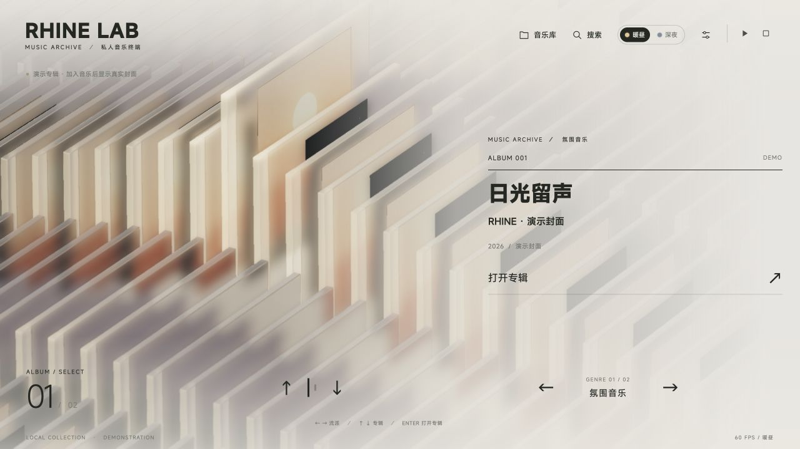 |  |

*图 8 · V0.2.0 历史配图：同一演示专辑的主题对照。版式和辅助标志位置保持一致，场景、文字与阅读底色共同转色；深夜遮罩承担背景压暗，文字与导航维持其上的阅读层级。静态对照展示最终层级，不能用于证明淡入期间的帧时。*

| 元素 | 当前节奏 |
| --- | --- |
| 主界面浏览层 | 720ms 进入、140ms 退出；阅读底色、信息、导航、提示各自同步淡入。 |
| 详情信息层 | 360ms 进入、240ms 退出；正文进入时从右侧 36px 归位，退出到右侧 52px。 |
| 搜索／音乐库／设置弹窗 | 300ms 进入、200ms 退出；保留可打断的透明度与小位移。 |
| 页签正文／下划线 | 正文 150ms 淡入，下划线沿既有轨迹连续移动。 |
| 详情逐行遮挡揭示 | 可见后停留约 0.35 秒，再按约 0.95 秒扫开；与主页字轮分开控制。 |

[SurfaceTransition](src/ui-transitions.ts) 在快速反向时先取得当前透明度与位移，再取消旧动画；只有当前修订能结束可见生命周期。退出中的面板保留节点和输入隔离，关闭结束后再恢复焦点或执行搜索选择，避免快速 Esc 穿透到底层。启动进场保留导航各组轻微错峰，动画作用于内层组，与浏览层淡入分工明确。

## 玻璃壳、封面与灯光

### 透射薄壳与昼夜材质

音乐盒使用 [music-cd.blend](art/music-cd.blend) 与 [建模脚本](art/build_music_cd.py) 的薄壳，运行时统一尺寸；不包含原版双环、光盘或机械内构。音乐入口保留详情拖动，不公开独立 360°、拆解与重组入口。

V0.2.0 已撤回初版的不透明背托，恢复 V0.1.1b 的透射薄壳；V0.3.0 在该基线上分别处理昼夜材质。基础配置仍为非金属、IOR 1.46。暖昼主壳透射 0.88、光学厚度 0.10、粗糙度由浏览 0.48 柔化至详情 0.44，搭配暖灰边框，让盒体在浅背景中保留轮廓。这里的光学厚度是材质参数，盒体几何尺寸不变。

深夜保留原参数：盖板透射 0.96、粗糙度 0.4，详情柔化至 0.3；边缘透射 0.84、粗糙度 0.25，扩散层透射 0.66、粗糙度 0.4。昼夜材质和环境共用约 650ms 过渡，选中实体、归位副本与阵列实例采用同一套主题参数；清晰封面印刷与玻璃磨砂保持独立。

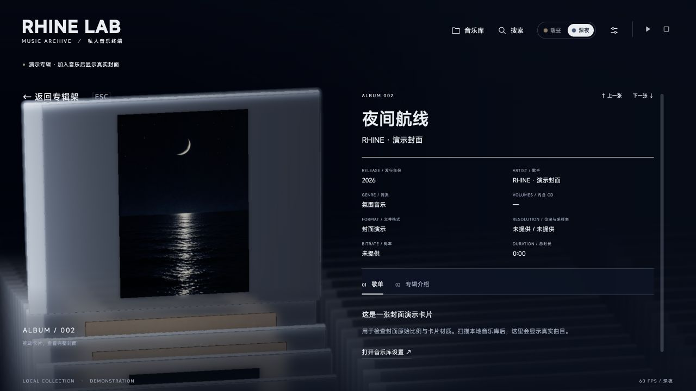

*图 9 · V0.2.0 历史配图：实际详情画面。留意外缘高光、壳体透光、印刷封面和后方阵列之间的层次。竖版封面保留原图比例及侧面留白，玻璃盒本身仍与方形、横版封面使用相同尺寸。*

### 封面是受光的表面印刷

封面位于玻璃前方，保留原图比例与必要留白；玻璃散射和磨砂不覆盖印刷。当前封面使用无高光的漫反射材质，接受场景光照与阴影，再按所处列、行、抬起高度和主题进行有界衰减。强光不把印刷颜色推成白色，远处和背后的专辑在深夜能随环境变暗。

待选列侧光从阵列外照向盒侧，相邻位置保留柔光，远处逐渐降低；暖昼偏暖、深夜偏冷白。侧条向面板内的导光由实时有界散射近似，不宣称屏幕空间透射能真实递归计算多层玻璃。选中实体、归位副本与阵列实例使用同一套世界空间受光，交接时不会改变曝光。

### 交接不再改变封面比例

封面图集、选中高清画布和归位快照共用 1024 逻辑坐标绘制及 **1/128 的相对边距**。旧做法在 256px 和 1024px 画布都扣固定像素边距，导致视觉占比不同；动画结束更换所有权时便像突然缩放。统一相对边距后，实际贴图分辨率可以不同，画面内容占比与留白仍相同。

音乐模式不再生成或复制不可见的原版档案标签。介绍等元数据更新不要求重绘未变化的封面图集；只有相关绘制输入改变才失效。保留原有画质选项和渲染能力，不通过悄悄降低分辨率或关闭阴影解决文字出现时的停顿。

封面切换优先同步复用已解码图片或图集中同一专辑的已绘制封面，再异步补齐清晰度；解码中的请求共享，避免缓存驱逐造成重复解码。退出专辑的封面快照保持已显示图片，异步结果不能回写过时的选中目标。

实现见 [music-model.ts](src/music-model.ts)、[music-lighting.ts](src/music-lighting.ts)、[cover-atlas.ts](src/cover-atlas.ts) 和 [scene.ts](src/scene.ts)。

## 搜索定位与播放反馈

歌曲搜索结果和顶部播放歌名保留准确的 album ID 与 track ID，点击只负责导航定位，不改变播放。顶部标题在播放、暂停或加载时可定位，所属专辑已打开时直接从当前滚动位置向上／下定位；若当前是专辑介绍，先切回歌单。该专辑仍在进入时沿用正在进行的打开动作，完成后再滚动。跨专辑时遵守上面的 archive 路线；目标详情进入完成后切到歌单，在详情滚动容器内平滑移动到该曲目，不滚动整个窗口。同一专辑中的搜索也定位具体曲目，不能只打开专辑就丢失歌曲身份。

目标行尽量居中于吸顶页签下方。滚动根据距离约 320–700ms；完成后聚焦该行，背景与左边线同步淡入淡出两次，每次 1000ms：320ms 淡入、160ms 保持、400ms 淡出、120ms 透明间隔，随后恢复正常。两种定位共用提示，不修改播放器当前曲目，因此不会冒充正在播放的高亮。

用户手动滚轮、触摸、按键、点击或调整窗口时可取消定位；切换专辑、返回或开启另一个面板也取消旧请求。详情还在进入期间的手动操作同样优先，不能在动画结束后又被迟到的搜索滚动拉回。减少动态效果时直接定位，以 1100ms 静态提示代替移动和闪动。

实现见 [music-track-focus.ts](src/music-track-focus.ts) 与 [music-app.ts](src/music-app.ts)。

## 声音、启动和数据边界

设置中的“切歌淡入淡出”对没有保存过偏好的用户默认开启；已有保存的 true／false 均继续沿用。启用后，正在播放的旧歌曲约 450ms 淡出，释放旧音源后才开始下一首，再约 450ms 淡入；两首歌曲不重叠播放。暂停、连续选曲和关闭开关由可取消的播放操作处理，音量仍按用户设定值计算。

歌曲、氛围 BGM 和界面音效分别控制。BGM 在歌曲开始前淡出、停止后按其开关恢复；不能把歌曲淡入淡出开关当成所有界面动画或所有音频的总开关。实现见 [music-player.ts](src/music-player.ts)。

音乐入口只保留约 **5.2 秒的实时三维进场**，取原时间轴的阵列进入片段，经过波浪与侧光收束到专辑待选构图，随后显现控件。Enter、Esc 或“跳过进场”可跳过；减少动态效果直接进入。正常入口不恢复原版 2D 接入片头、不提供重播按钮、不在开场结束后自动打开专辑。实现见 [music-boot.ts](src/music-boot.ts)。

每列 48 个循环位置是可见池容量，不是新增的真实专辑。歌曲与专辑按本地索引排列；根目录直属音频各自成为单曲专辑，子文件夹按含音频的文件夹归并。默认以流派排列，也可按歌手或专辑名排列；改变显示顺序和人工分类不会反写音频标签。

当前发布支持 macOS，本地服务只监听 127.0.0.1。演示封面用于展示无私人曲库的界面；真实音乐、缓存和个人配置不作为设计素材分发。播放器由浏览器解码，索引成功不表示该编码已验证播放；DSF／DFF 暂不支持播放。音乐入口不提供在线搜歌、云同步、歌词或均衡器，也不继承原版在线站点的 PWA 离线承诺。

## 维护与验证口径

本文按当前源码、保留的历史版本说明与用户明确取舍整理。旧文档中的 2D 片头时间轴、档案内部透明化、查看器拆解、原版固定 40 份档案、黑条标题，以及“先抬起再波动”的试验，不应作为音乐入口的实现要求；需要维护原版时回到 [README.original.md](README.original.md)、相应源文件与历史提交追溯。

本文件中的实现说明结合源码核对与实际回归。本文和 README 均展示 V0.3.0 当前详情截图，沿用的 V0.2.0 图片与 GIF 已标为历史资料；新版截图和结果保存在 [V0.3.0 界面回归记录](docs/UI-REVIEW-V0.3.0.md)。V0.3.0 已完成 TypeScript 检查、Vite 生产构建、PWA 资源生成，以及 viewport、camera 和 21 项 presentation 检查；浏览器视觉回归使用隔离示例库，具体矩阵与未覆盖项以该记录为准。真实曲库播放、全格式解码与设备兼容性不包含在这项视觉检查中；2026-10-01 发行整理的构建、自动化检查和源码包记录见 [V0.3.0 发布检查](docs/RELEASE-V0.3.0.md)。历史 verification 结果只属于其记录版本。

维护时持续回归的重点是：

- 大横屏深夜从详情返回主页时的完整连续帧与帧时，以及与暖昼、竖屏的对照。
- 单行／多行、长中英标题、g／j 等下伸笔画与快速反向选择的连续性；字体加载和旋转窗口后的布局。
- 搜索跨行列往返、同专辑歌曲定位、吸顶页签遮挡、手动取消与连续搜索。
- 详情连续换片的受光、封面比例交接、盒体归位；返回后主界面速度保持原样。
- 宽高比 1.05 两侧的同步切换，以及真实音乐格式、切歌淡入淡出和已保存设置。

这些边界保留为验收范围，不以静态代码推断宣布实机流畅度、解码覆盖或全部设备兼容性。
