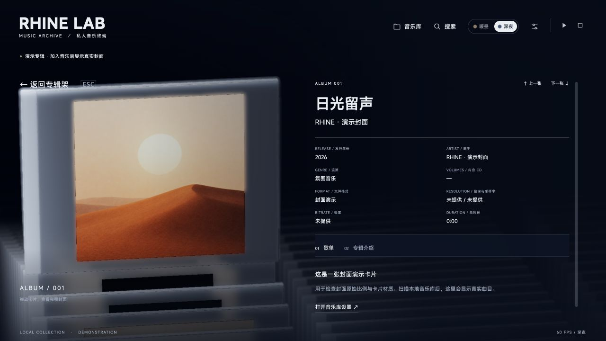

# 塞壬唱片播放器 · Rhine Music Demo V0.3.0

本地版本目录：V0.0.1 → V0.0.2 → V0.0.3 → V0.1.0 → V0.1.1 → V0.1.1b → V0.2.0 → V0.3.0。

**把塞壬唱片放进三维专辑架。** 以玻璃 CD 盒浏览《明日方舟》塞壬唱片官方曲库，打开专辑、查找歌曲，并在浏览器中播放官方音频。


> **V0.3.0 · 2026-10-01**，macOS 源码发行版。下载包完整解压后得到 **`V0.3.0/`**，使用目录中的启动器运行。

音乐适配与维护：[RonaldDeng](https://github.com/RonaldDeng) · 基于 [LBEILC / RhineLabUI](https://github.com/LBEILC/RhineLabUI)

[**下载 V0.3.0 macOS 源码包**](https://github.com/RonaldDeng/Rhine-Music-Demo/releases/download/v0.3.0/Rhine-Music-Demo-v0.3.0-macOS.zip) · [V0.3.0 Release](https://github.com/RonaldDeng/Rhine-Music-Demo/releases/tag/v0.3.0) · [更新记录](CHANGELOG.md) · [设计细节](DESIGN.md) · [版权与来源](NOTICE.md)


*V0.3.0 实际界面，1920 × 1080。使用隔离示例库、三张内置演示封面和 54 条占位曲目；画面中的曲名、时长与数量用于界面检查，不包含私人音乐，也不代表音频播放验证。[本版截图与检查范围](docs/UI-REVIEW-V0.3.0.md)。*

> 本版本支持 **macOS**，在本机运行 Node.js 服务，由浏览器显示界面。下载的是源码包，**不是 `.app` 安装包，也不附带歌曲**。首次启动会从塞壬唱片官方 API 读取目录，音频、歌词和封面按需播放或下载；上图的占位歌单仅用于隔离环境下的界面检查。下文沿用的 V0.2.0 图片和 GIF 均标为历史资料。

## 塞壬唱片版本

本版本将 Rhine Music Demo 的三维专辑架、专辑详情和播放控制改造成 **Monster Siren Records（塞壬唱片-MSR）播放器**。正式启动时，`GET /api/library` 从塞壬唱片官网目录生成曲库；当前已接入官网返回的专辑、歌曲、官方封面、官方音频和歌词地址。未下载的歌曲由本机服务代理播放，点击歌曲右侧“下载”即可保存到本机。

- 官方曲库：[塞壬唱片官网](https://monster-siren.hypergryph.com/music)；服务端使用 `https://monster-siren.hypergryph.com/api/songs`、`/api/song/:cid` 和 `/api/album/:albumCid/detail`。
- 官方封面：播放器只使用官方接口的 `coverDeUrl`，缺失时回退官方 `coverUrl`；不调用网易云或其他第三方封面服务。
- 下载器：保存官方音频、歌词、官方封面和 JSON 元数据；支持并发下载、断点可播放代理和可选 WAV→FLAC（需要系统 `ffmpeg`）。
- 默认下载目录：`~/Music/Siren-MSR`。可在设置面板修改，也可使用 `SIREN_DOWNLOAD_DIR`；服务缓存使用 `MUSIC_DATA_DIR`。
- 原始本地音乐扫描服务仍保留在 `GET /api/library/local`，用于兼容 Rhine 的开发检查；播放器默认界面显示塞壬唱片官方曲库。

## 三步开始

需要 [Node.js](https://nodejs.org/) **22.12 或更新的 LTS 版本**（包含 npm），以及支持 WebGL 2 的现代浏览器。普通运行无需 Blender。

1. 下载 `Rhine-Music-Demo-v0.3.0-macOS.zip`，完整解压并进入 `V0.3.0` 文件夹。
2. 双击 **`启动音乐播放器.command`**。首次启动会联网安装锁定依赖、构建界面并打开默认浏览器。
3. 打开后点击“**塞壬唱片**”查看官方曲库。进入专辑后可直接播放；在歌曲右侧点击“下载”保存音频、歌词和官方封面。下载目录、自动歌词、WAV 转 FLAC 与并发数可在“播放与下载”设置中调整。

首次加载会从塞壬唱片官网读取目录并缓存到 `MUSIC_DATA_DIR/siren/`；网络可用时点击“刷新官方曲库”获取最新目录。日常使用再次双击同一启动器即可；已经运行的同一工程服务会直接复用。

<details>
<summary>双击没有启动，或希望从终端运行</summary>

在终端进入**解压后的工程目录**，执行：

```sh
bash "启动音乐播放器.command"
```

若只是可执行权限丢失，可执行 `chmod +x "启动音乐播放器.command"` 后再双击。提示找不到 Node.js / npm 时，先安装符合版本要求的 Node.js，然后重新打开终端。

也可以手动安装、构建并保持服务在前台运行：

```sh
npm ci
npm run build
npm run music -- --port 5175
```

打开 [http://127.0.0.1:5175/](http://127.0.0.1:5175/)，以终端输出地址为准。前台运行用 `Ctrl+C` 停止。

启动器优先使用 `5175`，占用时顺延到空闲端口。双击启动器创建的是后台服务，关闭终端或浏览器不等于停止服务；日志位于工程旁 `music-data-v3/player-service.log`。更新前，可在 macOS“活动监视器”中找到此工程的 Node 音乐服务进程并退出，避免同时启动两个版本操作同一数据目录。

`npm run dev` / `npm run preview` 只提供前端，不能代替本地音乐服务。首次依赖安装与构建完成后，扫描本地文件和播放不要求在线资料查询成功。

</details>

## 可以做什么

| 功能 | 使用方式与效果 |
| --- | --- |
| 浏览收藏 | 按流派、歌手或专辑名排列；滑尺标记与编号同步，分类和专辑首尾循环。三维进场约 5.2 秒，可跳过。 |
| 打开专辑 | 盒体抽出，镜头同步上抬与横移，保留略平于主页的俯视；在卡片上拖动可旋转查看。 |
| 连续换专辑 | 详情右上“上一张／下一张”直接沿队列换片，信息先退出再进入。回到主页继续使用正常浏览速度。 |
| 搜索歌曲 | 点具体歌曲结果后进入专辑，平滑滚到该曲目，淡入淡出高亮两次，**不会自动播放**。在详情中搜索会先返回专辑架，再移动并重新打开。 |
| 播放音乐 | 点歌单中的歌曲，从该曲开始连续播放当前专辑；顶部提供播放、暂停和停止；点击歌名定位正在播放的歌曲：所属专辑已打开时直接滚动，否则经专辑架打开。切歌淡入淡出默认开启，可在设置中关闭。 |
| 调节体验 | 暖昼／深夜主题；横竖屏自适应；独立的歌曲、氛围配乐及音效音量；画质与减少动态效果。 |
| 管理资料 | 读取标签、封面、格式和时长，增量扫描；可选择查询有来源的百科介绍和 MusicBrainz 资料，不改写音频标签。 |



*V0.2.0 历史演示图，用于展示已有详情功能；当前 Esc 位置和暖昼壳体见上方 V0.3.0 截图。演示详情不包含真实歌单，加入本地音乐后显示实际歌曲和标签。*

<details>
<summary>查看 V0.2.0 暖昼历史演示图</summary>


</details>

### V0.3.0 的主要变化

- 横屏主页专辑名称向右移动，文字区占约 29.17% 屏宽，渐变同步右移以展示更多阵列。
- 点击顶部歌名，所属专辑已打开时直接向上／下滚到该歌曲；否则先返回专辑架、移动到目标列和专辑后打开。暂停或加载时也可定位，播放状态保持不变。
- 所有横屏主页为抬起的专辑增加顶部空间：下移 8% 屏高，随 16:9 到 21:9 的比例增加至 10%，同时向左移动最多 3.5% 屏宽。
- 详情返回按钮（Esc）在横屏、竖屏及超宽屏均位于左上 Rhine Music 标识下方；移除顶部中文曲库统计，底部继续显示 `LOCAL COLLECTION · 专辑数 ALBUMS / 曲目数 TRACKS`。
- 主标题增大行高并收窄字轮边缘淡出，完整保留 g／y／p／j 的下伸笔画。
- 暖昼壳体增加轻磨砂和暖灰边框的可见度，深夜继续保留原有透光效果；昼夜材质变化与主题平滑过渡同步。
- 切换专辑时复用已显示封面，减少占位图造成的闪跳。
- 搜索和顶部歌名定位共用两次淡入淡出高亮，总计 2 秒；减少动态效果使用短暂静态提示。

### V0.2.0 的主要变化

- 搜索后定位具体曲目并提示；区分搜索导航和详情内直接换片。
- 修正换片结束时封面比例跳变；壳体沿用 V0.1.1b 的轻磨砂透射，封面随场景光照变暗。
- 改进标题拟合与缓存，第二行一起滚入，清理 `g / j` 等下伸笔画的残留。
- 修正深夜横屏返回主页时遮罩与文字的层级跳变，底色、文字和导航分别淡入。
- 歌曲淡入淡出默认开启，先淡出当前曲再淡入下一曲。**已有保存的开关选择继续沿用**。

导航栏、主题滑块、辅助标志、字轮与响应式的设计说明见 [DESIGN.md](DESIGN.md)，配有 V0.2.0 底部导航、字符滚动、专辑抽取与连续换片的历史 GIF，以及 V0.3.0 当前详情截图；完整版本演进见 [CHANGELOG.md](CHANGELOG.md)。

## 操作速查

| 操作 | 功能 |
| --- | --- |
| `← / →` | 切换当前排列方式的分类，首尾循环 |
| `↑ / ↓` | 切换当前分类的专辑；详情中直接换片 |
| `Enter` | 打开当前专辑；进场期间跳过进场 |
| `Space` | 播放／暂停；尚未选曲时播放当前专辑 |
| `/` 或“搜索” | 查找专辑与歌曲 |
| `Esc` | 关闭弹窗或返回专辑架；进场期间跳过进场 |
| 点击顶部播放歌名 | 已打开所属专辑时直接滚到歌曲，否则经专辑架定位并打开 |
| 点击歌单中的歌曲 | 从指定曲目开始播放 |
| 拖动详情中的 CD 盒 | 旋转查看封面与盒体 |

输入框内不会触发曲库导航快捷键。设置中的“切歌淡入淡出”采用约 **450ms 淡出 → 换曲 → 450ms 淡入**，两首歌不叠播。氛围配乐在歌曲播放前淡出、停止歌曲后恢复；暂停歌曲时保持安静。

## 数据与升级

默认数据目录为工程旁的 **`../music-data-v3/`**，保存目录配置、索引、封面缓存、流派规则和日志。歌曲始终从原路径读取，不复制进工程、不修改标签。个人曲库和本机配置**不包含在 GitHub 仓库及 ZIP 中**。

从本地 V0.0.3、V0.1.0、V0.1.1、V0.1.1b 或 V0.2.0 升级：先停止旧版服务，将新工程放在旧工程的同一父目录，继续使用旁边的 `music-data-v3`。保留旧目录便于回退，避免新旧服务同时写同一数据目录。主题、画质、音量等界面偏好保存在浏览器中；更换浏览器或端口可能使用另一套偏好。

需要使用其他数据位置时，在工程目录运行：

```sh
MUSIC_DATA_DIR="../music-data" bash "启动音乐播放器.command"
```

根目录直属音频各为一个单曲专辑；子文件夹按每个含音频的文件夹归并，多个 CD 子文件夹目前分别识别。移动歌曲或文件夹会产生新 ID；暂时离线的根目录保留缓存。旧根目录合辑重扫后变为独立单曲，原合辑的人工流派不会自动分发给新单曲。

## 支持范围与常见问题

**能索引但不能播放？** 标签解析与播放解码是两件事。可读取 FLAC、WAV、M4A、MP3、DSF、DFF 等元数据，实际播放取决于浏览器和编码；DSF／DFF 暂不能播放。M4A 不一定是无损 ALAC。本版不提供外部播放器、DAC 或 DSD 直出承诺。

**大窗口下帧率较低？** 三维玻璃、阴影、环境遮蔽和景深会增加渲染开销，可在设置中降低画质或关闭景深。截图右下角数值仅是拍摄当时的状态，不是性能基准。

**页面还是旧界面？** 修改源码后重新 `npm run build`；更换发布目录后停止旧服务再启动新版，并访问新启动器输出的地址。安装过离线应用时，留意界面的版本更新提示。

**没有专辑介绍？** 介绍是可选查询结果，不会编造缺失资料。“查询／更新专辑介绍”核对正式百科页面的专辑、歌手和年份，保留出处。MusicBrainz 自动补全默认关闭，启用前填写自己的联系邮箱或项目网址；只发送查询所需文字／公开 ID，不上传歌曲。断网、限流、同名或资料不全时会保留对应状态。

服务仅监听 `127.0.0.1`，用于本机访问。GitHub 上公开的是源码，不是可读取你曲库的在线音乐网站。本版尚无歌词、频谱、均衡器、在线搜歌或云同步；音乐入口没有开放独立 360° 查看器、拆解与重组功能。

## 开发文档与检查范围

- [DESIGN.md](DESIGN.md)：现行视觉与交互设计、细节参数和演进依据。
- [CHANGELOG.md](CHANGELOG.md)：从上游和早期音乐原型到 V0.3.0 的有效改动。
- [音乐服务说明](docs/MUSIC-SERVICE.md)：数据目录、索引规则、API、音频与在线资料。
- [V0.3.0 界面回归记录](docs/UI-REVIEW-V0.3.0.md)：本轮自动化检查、隔离示例库的浏览器视觉回归及未覆盖范围。
- [V0.3.0 发布检查](docs/RELEASE-V0.3.0.md)：2026-10-01 发布整理、源码包及实际检查范围。
- [V0.2.0 发布检查](docs/RELEASE-V0.2.0.md)：前一正式版本的历史检查记录。
- [历史记录](verification/README.md)：上游、V0.0.2/V0.0.3 等阶段的设计与验证资料。

技术栈为 TypeScript、Three.js、Vite 和 Node.js；发布包保留源码、锁文件、运行资源、模型源文件与生成脚本，排除 `node_modules`、`dist` 和个人数据。模型维护见 [art/README.md](art/README.md)。原版档案入口 `?original=1` 与音乐界面共享资源；旧导航可用 `?nav=previous` 对照。

V0.3.0 已完成 TypeScript 检查、Vite 生产构建、PWA 资源生成，以及 viewport、camera 和 21 项 presentation 检查；已使用隔离示例库进行浏览器视觉回归。具体尺寸、主题、截图和未覆盖范围见 [本轮记录](docs/UI-REVIEW-V0.3.0.md)。示例库视觉检查不代表真实曲库播放、全格式解码或设备兼容性验证；本次发行的构建、自动化检查与打包结果见 [V0.3.0 发布检查](docs/RELEASE-V0.3.0.md)。旧版截图与历史测试结果不作为新版通过依据。

## 版权与来源

**音乐适配与后续修改：Copyright (c) 2026 RonaldDeng。**

**上游 RhineLabUI：Copyright (c) 2026 LBEILC。**

有权授权的代码、建模脚本及技术文档沿用 [MIT License](LICENSE)，两方署名和许可原文均保留；复用或分发代码及其重要部分时应继续保留。上游初始提交为 [`5abab023`](https://github.com/LBEILC/RhineLabUI/tree/5abab02367465d9189f4ae65bcb6f17fdb5938f7)，[原版说明](README.original.md)与 Git 历史一并保留。音乐适配不代表上游作者参与或认可本版本。

《明日方舟》及「莱茵生命：访问」中的名称、标志、设定、视觉和声音归相应权利人所有，本项目与官方无隶属关系。**代码 MIT 不自动覆盖模型、图像、字体或原 PV 采样，也不代替第三方授权。** MiSans、Rolling Number、Three.js、music-metadata、OpenCC-JS 等保留各自许可；原 PV 三个短音不纳入 MIT。完整来源、许可边界及对应文本请见 [NOTICE.md](NOTICE.md)。
