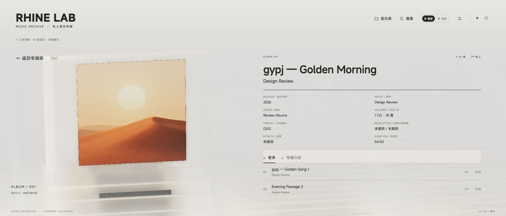
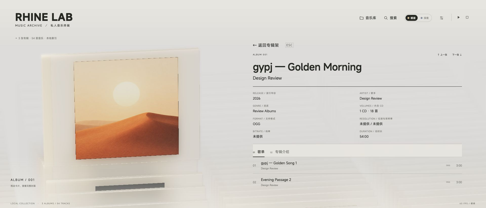
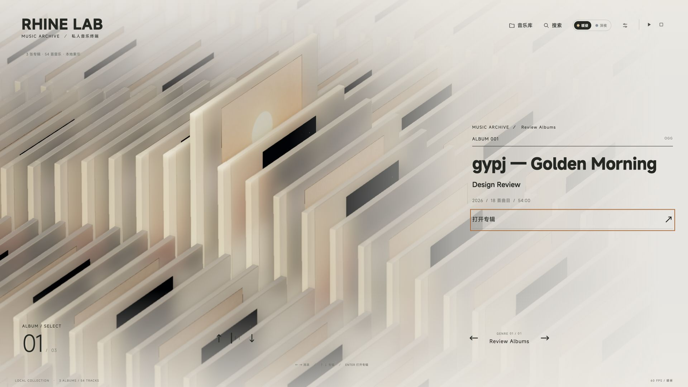

# V0.3.0 界面回归记录

界面检查日期：2026-09-30，当时为本地开发版。V0.3.0 于 2026-10-01 整理发布，发布检查见 [RELEASE-V0.3.0.md](RELEASE-V0.3.0.md)。

前一轮使用 macOS 上的内置浏览器检查生产构建，通过视口设置模拟下文所列 CSS 像素尺寸；最新 Esc 修订另见下一节。未操作系统级全屏或外接显示器。测试服务使用隔离的三张示例专辑、内置演示封面和每张 18 首合成曲目；定位交互使用 180 秒静音 WAV。未读取、扫描或改写个人曲库。

## 最新修订：Esc 位置恢复（2026-09-30）

按用户最新要求，详情返回按钮（Esc）在所有屏幕比例下均回到左上 Rhine Music 标识下方。顶部正常状态的中文专辑／曲目统计已移除，底部英文统计继续由曲库数据动态生成。扫描、加载、离线等临时提示保留，详情内隐藏该状态行以避免与返回按钮重叠。

本次使用独立的本地服务与三张内置演示封面、54 条占位曲目验证生产构建；没有读取或扫描个人曲库，也没有进行音频播放测试。

| 视口 | 主题 | Esc 左／上坐标（CSS px） | 结果 |
| --- | --- | --- | --- |
| 1920 × 1080 | 暖昼 | 62 / 144 | 标识下方，中文计数消失，底部英文计数保留 |
| 1920 × 823 | 暖昼 | 62 / 144 | 超宽屏保持左上位置，与专辑盒分离 |
| 1024 × 576 | 深夜 | 27 / 91 | 短屏按钮可见、可点击，与专辑盒分离 |
| 390 × 844 | 暖昼 | 22 / 118 | 竖屏位于顶部控件下方、专辑盒上方 |

点击返回按钮和按 Esc 均能退出详情、恢复“打开专辑”入口。示例底部显示 `LOCAL COLLECTION · 3 ALBUMS / 54 TRACKS`，统计逻辑未改动，个人曲库仍显示其实际数量。

本次重新执行 `npm run build`、`npm run check:viewport`、`node scripts/check-music-presentation.mjs`（21 项）及 `git diff --check`，全部通过；Vite 保留已有的大于 500kB 产物提示。

[超宽屏暖昼（2026-10-01 补拍）](media/v0.3.0/ui/esc-brand-1920x823-day.jpg) · [短屏深夜](media/v0.3.0/ui/esc-brand-1024x576-night.jpg) · [手机竖屏](media/v0.3.0/ui/esc-brand-390x844-day.jpg)

## 前一轮修正记录

> 下文保留此前布局与测试证据。其中“返回按钮位于右侧正文上方”的方案已经由上节最新修订替代，下方旧截图不表示当前 Esc 位置。

- 横屏主页相机增加 8% 屏高的下移基线；16:9 到 21:9 之间平滑增加到 10%，左移从 0 增至 3.5% 屏宽。进场末段和主页共用目标，竖屏保持原相机偏移。
- 横屏返回按钮与右侧正文共用左边界及顶部基准，按钮位于正文上方，避开左侧盒体。在实测尺寸中，按钮底边到正文顶边留有 21px。竖屏详情中，返回按钮替代音乐库状态行，修正原按钮压到盒子上缘的问题。
- 主标题字轮行高改为 1.4，边缘淡出缩小至 0.02em，仍裁剪相邻字面，避免退出字母残留。
- 暖昼增加壳体密度、边框色差及磨砂；详情每帧的 clarity 更新保留暖昼粗糙度。深夜恢复原材质参数，主题切换仍为 650ms。封面材质与玻璃相互独立。

## 浏览器检查

| 视口 | 检查内容 | 结果 |
| --- | --- | --- |
| 1920 × 1080（16:9） | 暖昼主页、详情，标题下沿，进入／返回 | 抬起的专辑留出顶部空间；返回按钮和盒体分区；字母完整 |
| 1600 × 900（16:9） | 暖昼主页、详情，长英文两行标题 | 返回按钮与正文无重叠；标题和打开按钮可见 |
| 1920 × 823（约 21:9） | 暖昼／深夜主页和详情，主题往返，深浅封面 | 已复现并修正旧返回按钮覆盖盒体的问题；暖昼壳体边缘和表面可辨 |
| 2520 × 1080（21:9） | 暖昼主页、详情，中英双层标题，键盘切换 | 模型与正文保持分区；抬起的盒体不贴顶 |
| 1024 × 576（16:9） | 暖昼短屏详情 | 返回按钮与正文间距正常，歌单独立滚动 |
| 390 × 844（竖屏） | 暖昼主页、详情，长标题、返回按钮 | 新增修正后返回按钮位于盒体上方；主页标题、导航无重叠 |

主标题 `g / y / p / j` 在 44px MiSans 字号下的 DOM 测量：修正前字形区域高度 58.5px，字轮只有约 51.04px，底部还叠加 3.52px 淡出；修正后字轮约 61.6px，上下各有约 1.5px 留白，淡出仅 0.88px。截图确认下伸笔画完整。单行、多行和中英副标题均检查，逐字滚动仍保留。

上下键换片及反向切换进行了浏览器操作与过渡截图抽查，没有观察到占位图闪回。此项为局部视觉抽查，不等同于所有封面、所有 GPU 或完整逐帧性能基准。

## 定位交互

- 播放第 18 首后回到上方，点击顶部歌名：歌单向下定位；随后播放第 1 首并滚到底部，点击歌名向上定位。两次采样的 `data-presentation` 始终为 `detail`，`data-camera-phase` 始终为 `presented`，没有退出／重新打开。
- 进入专辑介绍后点击当前歌名，返回歌单并定位。
- 在另一张专辑详情内点击播放标题，观测到 `hiding → returning → selecting → opening → detail`，最终回到当前播放歌曲所属专辑。
- 搜索另一张专辑的第 18 首，按上述顺序切换并滚动到目标。播放标题和搜索分别采样到了两次背景色由透明升起、再回到透明的脉冲；定位后恢复透明，播放曲目不随搜索改变。

## 命令检查

- `npm run build`：TypeScript、Vite、PWA 生成通过。Vite 仍有既有的单个产物大于 500kB 提示。
- `npm run check:viewport`：通过。
- `node scripts/check-music-camera.mjs`：通过，包括横竖屏边界、多比例、偏移封顶、连续性及既有相机运动检查。
- `node scripts/check-music-presentation.mjs`：21 项通过。
- `node scripts/check-music-model.mjs`：通过，包括主题往返、650ms 中间态、每帧 clarity、夜间参数恢复和独立封面不被修改。
- `git diff --check`：通过。

未把本轮检查扩展为真实音乐格式兼容性、真实显示器全屏、全部设备或发布验收。

## 画面对照

21:9 暖昼详情修正前，返回按钮压到左侧盒子上缘，浅色壳体轮廓偏弱：

修正后，返回按钮位于右侧正文上方，盒体保留磨砂层和可辨的边缘：

16:9 主页，抬起的专辑上方留白，`gypj` 下伸笔画完整：

[深夜详情](media/v0.3.0/ui/after-1920x823-detail-night.jpg) · [竖屏详情](media/v0.3.0/ui/after-390x844-detail-day.jpg)

以上静态布局截图中早期使用 OGG 占位元数据；定位检查随后改用能实际解码的静音 WAV。截图与测试数据均为示例，不包含个人音乐。
